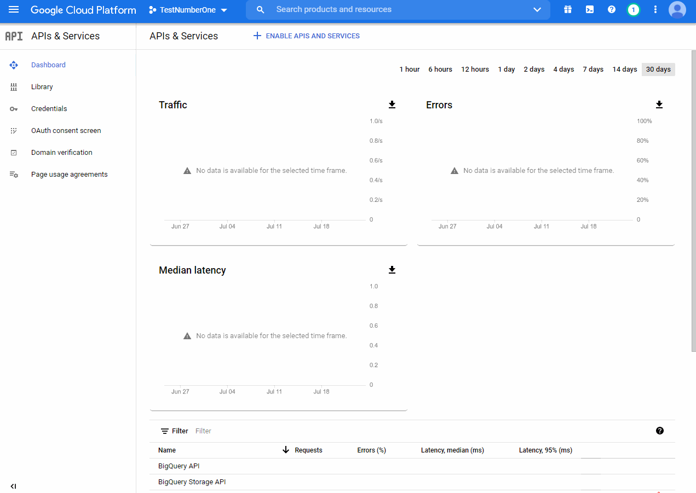
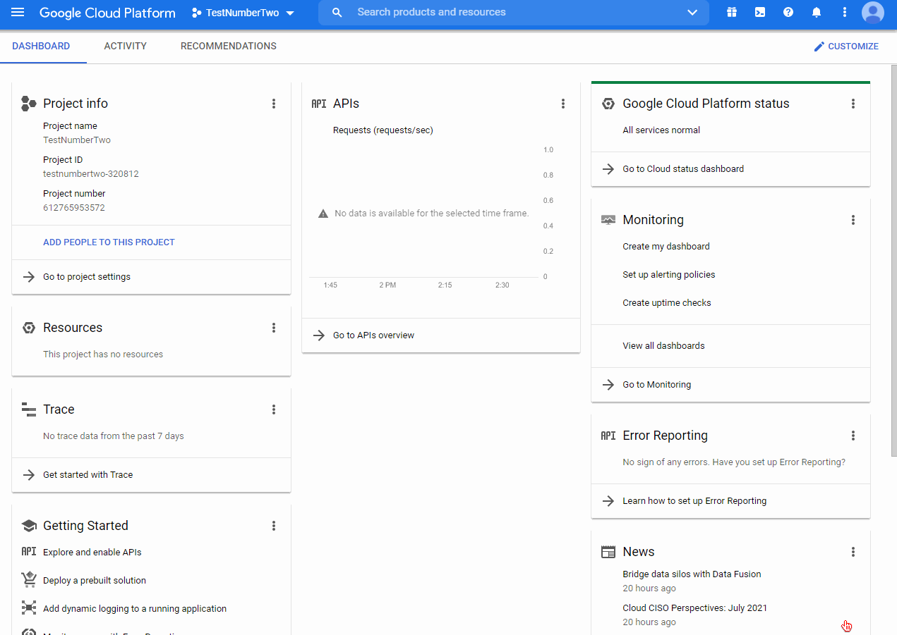
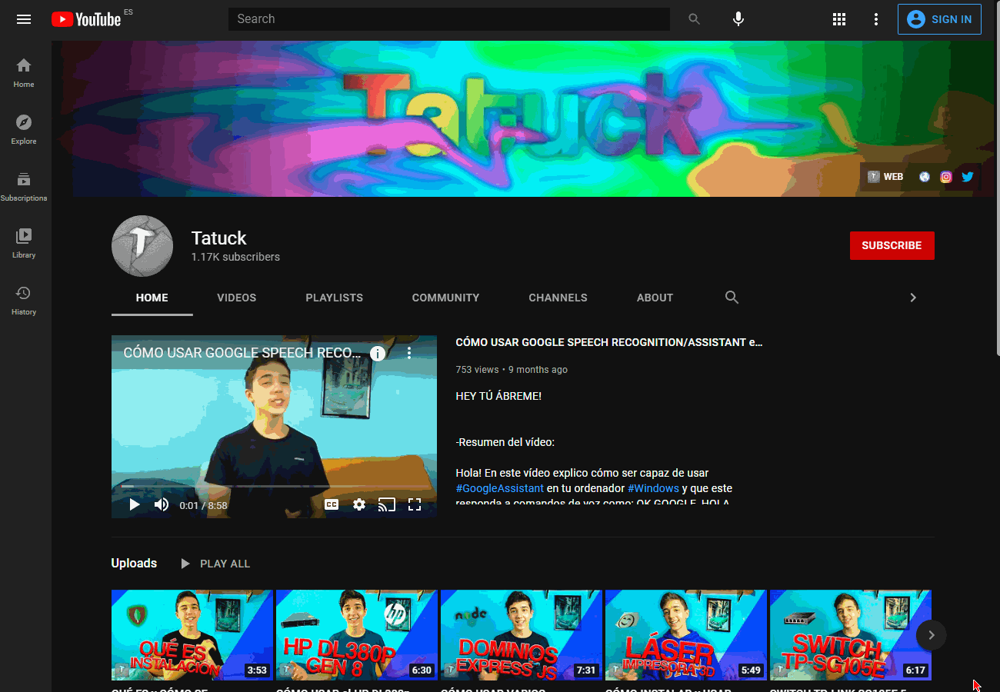

24-7-Discord-Music-Bot
=====

A Discord Bot coded in Python for playing music from a YouTube channel stream.

The bot uses a [YouTube API Key](https://console.cloud.google.com) making the bot able to fetch the latest stream from a channel.

Recomended: `Python 3.5+`

How to use:
----------

1. Edit the config.json file with the required parameters:

    `botToken`: [Your Discord Bot Token](https://discord.com/developers/applications)
    
    `channelID`: The ID of the voice channel the bot will join
    
    `youtubeID`: The YouTube channel ID
    
    `youtubeApiKey`: [The YouTube API Key so the bot can get the lastest stream from the YouTube channel](https://console.cloud.google.com)
    
2. Install the dependencies
  `pip install -r requirements.txt`
  
3. Run the bot
  `python bot.py`
  
How to get a YouTube API Key:
----------

1. Go to the [Google Cloud Platform](https://console.cloud.google.com)

3. Create a new project
    
    
3. Search `YouTube Data API v3` in `APIs & Services` -> `Library` and enable it
    
    
4. Select `Credentials`, then click `Create Credentials` and then `API key`, an API key will appear, that's what you need to paste on the config file.

How to get a YouTube channel ID:
----------

1. Open a YouTube channel URL
2. Open DevTools, you can do this by right clicking the page and selecting "Inspect", pressing the key `F12` or pressing `ctrl + shift + i`, then click any part of the HTML code
3. Press `ctrl + f` and write: `https://www.youtube.com/channel/`
4. Then the channel's ID will appear next to the link you have just searched. (You might have to press enter to go to the next result)
5. Right click the element and select `Edit as HTML` to copy the ID

Discord Server:
----------

[Discord](https://discord.gg/CaWNcmC)
